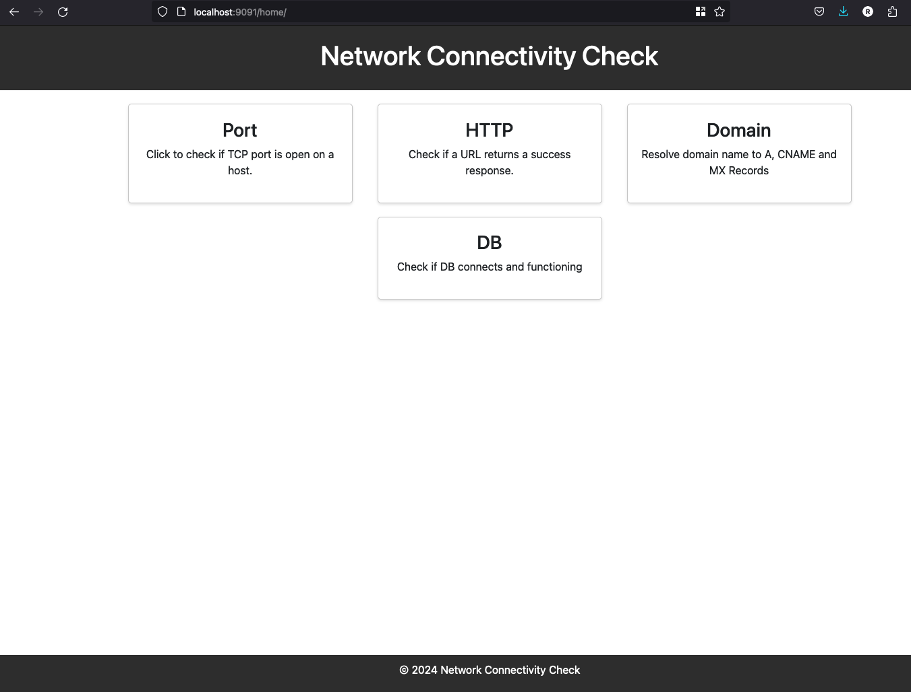
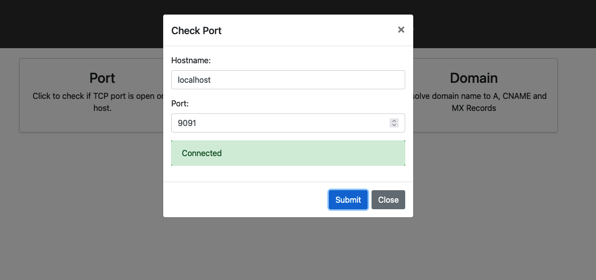
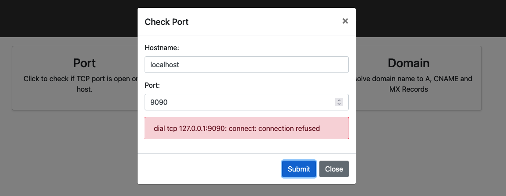
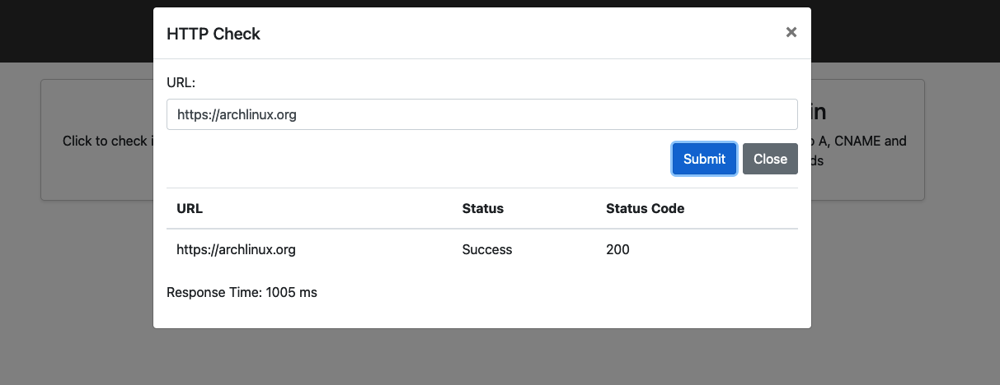
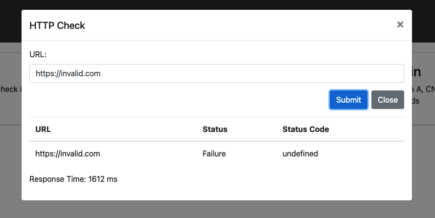
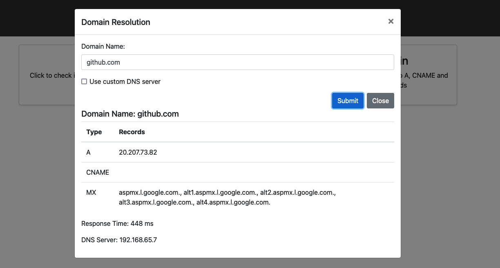
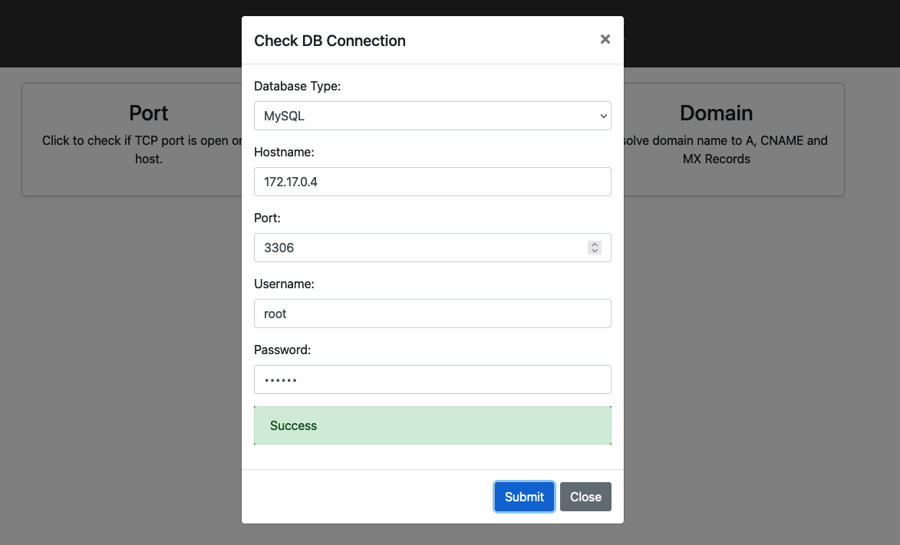

# Introduction
 Network Test UI provides a user-friendly, web-based interface for essential network diagnostics, allowing users to Check connectivity, ports, HTTP status, domains, and databases without needing CLI expertise.

 This was a personal project aimed at assessing connectivity across subnetworks once firewall access was authorized and implemented. The container image makes it easy to deploy it on managed services such as EKS, AKS, App Services & ECS.

# Pre requisites
 You can run it directly on your local machine either using Docker/Podman or by executing Go commands.

# How to Run
 
 ## 1. Go
  ```bash
  go run main.go
  ```
 ## 2. Docker
  ```bash
  docker run -it --rm  -p 9091:9091 ghcr.io/rdev2021/network-test:latest
  ```
  http://localhost:9091/home/ to launch the home page of the application.

 ## 3. Kubernetes (Selfmanaged, GKE, AKS or EKS)

  The sample below shows NodePort services however use proper Ingress in an actual K8s environment.

  ```yaml
  ---
  apiVersion: apps/v1
  kind: Deployment
  metadata:
    name: netpulse
  spec:
    replicas: 1
    selector:
      matchLabels:
        app.kubernetes.io/name: netpulse
    template:
      metadata:
        labels:
          app.kubernetes.io/name: netpulse
      spec:
        containers:
          - name: netpulse
            image: ghcr.io/rdev2021/network-test:latest
            ports:
              - containerPort: 9091
  ---
  apiVersion: v1
  kind: Service
  metadata:
    name: netpulse
    labels:
      app.kubernetes.io/name: netpulse
  spec:
    type: NodePort
    ports:
      - port: 80
        targetPort: 9091
        nodePort: 30171
    selector:
      app.kubernetes.io/name: netpulse
  ```

# Screenshots
 ### Home Page
 
 ### Port Check
 
 
 ### Http checks
 
 
 ### Domain checks
 
  ### Database checks
 

